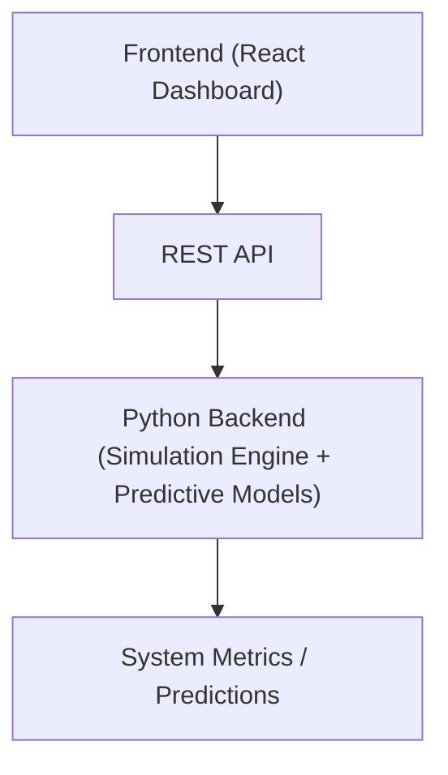

# Digital Twin Management Dashboard

A full-stack Digital Twin monitoring and predictive analytics dashboard built with React, TailwindCSS, and a Python simulation backend.  
The system simulates a digital twin environment where real-time system metrics are monitored and predictive models estimate failures and performance degradation.

---

## Overview
This project implements a Digital Twin system consisting of:
- A real-time monitoring dashboard
- A simulation backend
- Predictive analytics for system behavior
- Visualization of system metrics and alerts

The dashboard represents industrial monitoring platforms used in manufacturing, IoT systems, and infrastructure monitoring environments.

---

## System Architecture



### Components
- **Frontend:** Dashboard UI, charts, metrics, alerts
- **Backend:** Simulation engine, predictive models
- **API Layer:** Communication between frontend and backend
- **Digital Twin Model:** Simulated system state and performance

---

## Tech Stack

| Layer | Technology |
|------|------------|
| Frontend | React, Vite, TailwindCSS |
| Backend | Python |
| Charts | Recharts |
| API | REST API |
| Icons | Lucide Icons |
| Deployment | Vercel / Local |
| Version Control | Git, GitHub |

---

## Features
- Real-time digital twin monitoring dashboard
- System performance metrics visualization
- Predictive maintenance simulation
- Failure prediction alerts
- Responsive dashboard UI
- Frontend and backend integration
- Modular component architecture
- Simulation-based data updates

---

## Project Structure

```text
digital-twin-dashboard/
│
├── frontend/
│ ├── src/
│ ├── components/
│ ├── pages/
│ └── App.jsx
│
├── backend/
│ ├── main.py
│ ├── simulator/
│ └── models/
│
├── README.md
└── .gitignore
```

---

## Running the Project

### Backend (Python)
```bash
cd backend
python main.py
```

### Frontend (React)
```bash
cd frontend
npm install
npm run dev
```

**Open:**
[http://localhost:5173](http://localhost:5173)
